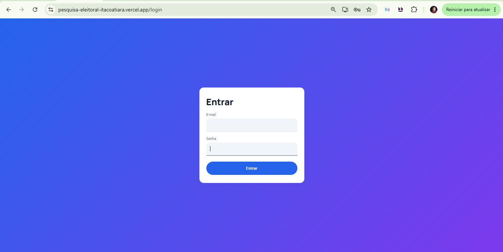
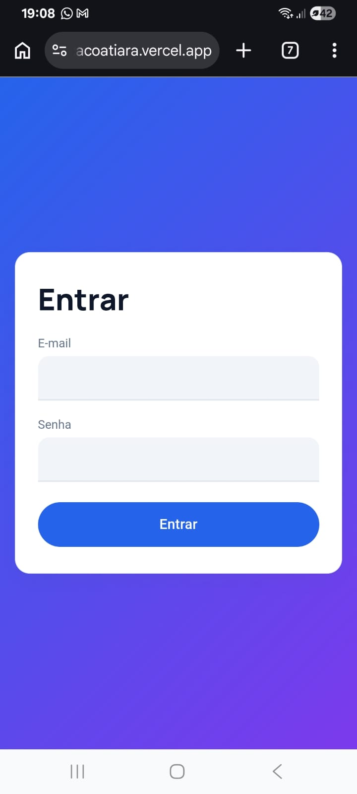
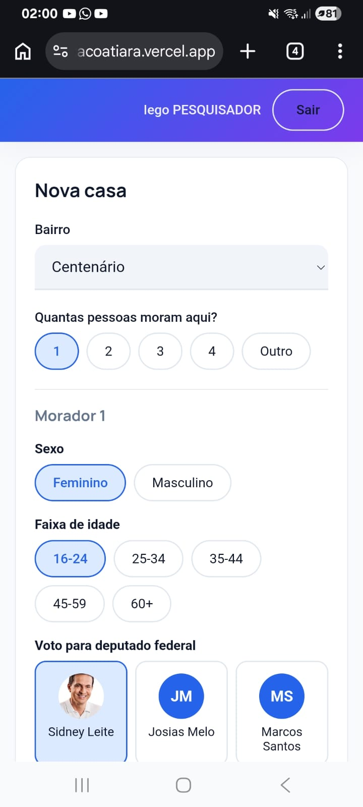
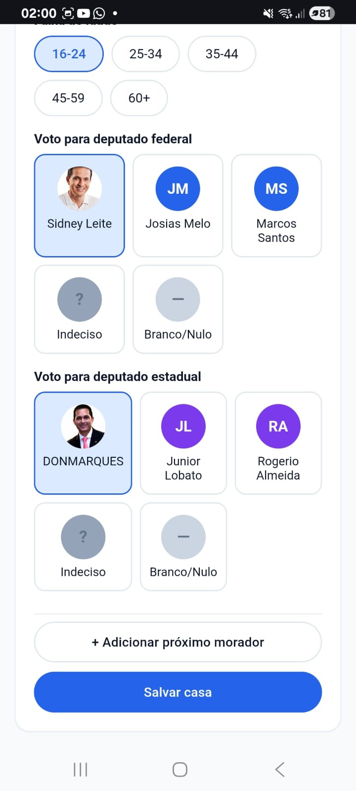
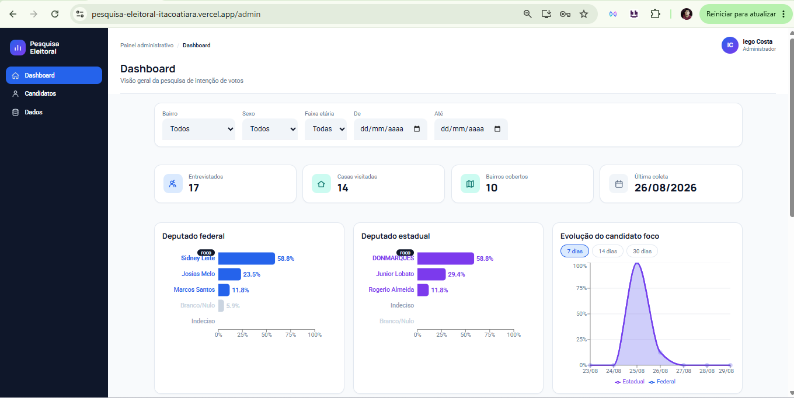
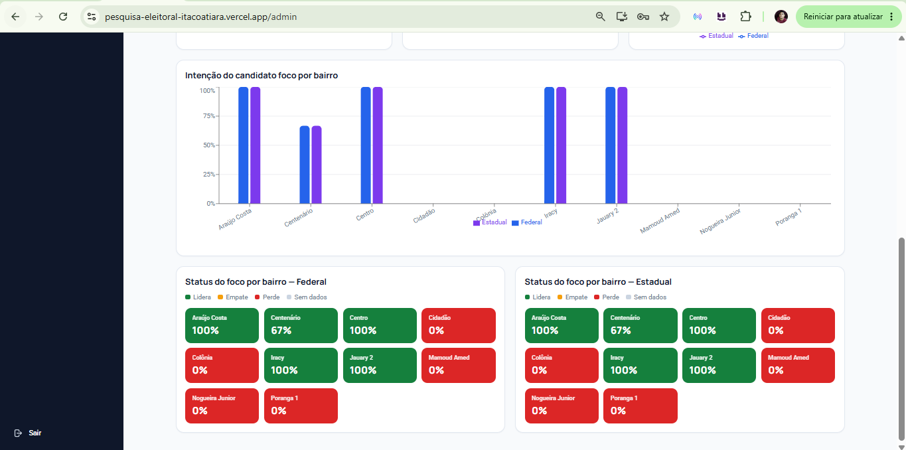
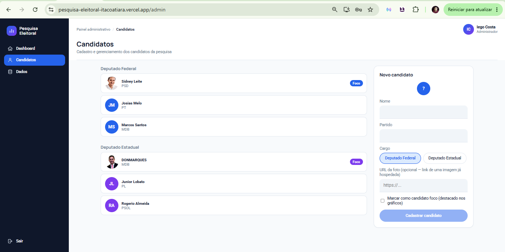
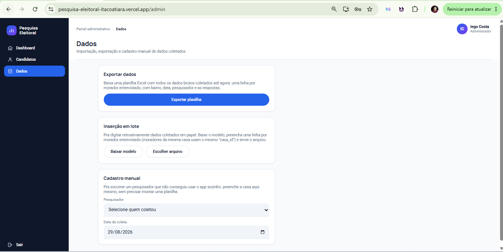

# Guia do Usuário — Pesquisa Eleitoral Itacoatiara

> **Sobre as imagens deste guia:** as capturas de tela abaixo são do sistema real em execução.

## 1. Acesso ao sistema

O sistema é acessado por um único link (não há loja de aplicativos). Ao abrir a URL, você cai na tela de **login**.

Depois de autenticado, o sistema identifica automaticamente seu papel e te leva direto para a tela certa:

- **Pesquisador** → tela de coleta (`/coleta`)
- **Administrador** → painel administrativo (`/admin`)

Não existe uma tela onde os dois papéis se veem — cada um só acessa a sua própria rota.

---

## 2. Guia do Pesquisador

### 2.1 Visão geral da tela

### 2.2 Passo a passo — registrar uma casa

**Pontos importantes:**

- O botão **Salvar casa** só fica ativo quando todos os moradores informados têm os quatro campos preenchidos.
- Ao salvar, os dados vão direto para o armazenamento local do celular — funciona **mesmo sem internet**. A sincronização com o servidor acontece sozinha assim que a conexão voltar.
- Se uma casa realmente falhar ao sincronizar (não apenas ficar pendente), um aviso aparece no topo da tela pedindo para avisar o administrador.
- O pesquisador **nunca vê números agregados** — só o formulário de coleta, casa após casa.

### 2.3 Instalando como aplicativo

Na primeira visita pelo celular, um banner sugere instalar o app na tela inicial:

- **Android/Chrome**: instalação direta, um toque.
- **iPhone/Safari**: instrução manual (compartilhar → "Adicionar à Tela de Início"), porque o iOS não permite instalação automática.

Depois de instalado, o ícone abre o app em tela cheia, sem barra de endereço do navegador.

---

## 3. Guia do Administrador

O painel administrativo tem uma **sidebar** fixa à esquerda com três seções, e um **cabeçalho** no topo com o título da seção atual e a identidade de quem está logado (visível no screenshot da seção 3.1, abaixo).

### 3.1 Seção Dashboard

- Cada **ranking** mostra os candidatos daquele cargo ordenados por percentual, com o candidato foco marcado por um selo "FOCO".
- **Evolução** tem seletor de período (7, 14 ou 30 dias).
- **Status do foco por bairro** usa três cores: verde (lidera), laranja (empate, diferença de até 5 pontos), vermelho (perde).
- Os **filtros** no topo afetam todo o dashboard ao mesmo tempo, exceto a evolução (que tem seletor de período próprio).

### 3.2 Seção Candidatos

**Passo a passo — cadastrar um candidato:**
1. Preencher nome, partido e cargo (federal ou estadual) no formulário à direita.
2. Opcionalmente, colar a URL de uma foto e/ou marcar como candidato foco.
3. Clicar em "Cadastrar candidato".

**Passo a passo — excluir um candidato:**
1. Clicar no candidato na lista para abrir o formulário de edição.
2. Clicar em "Excluir candidato" → aparece uma confirmação.
3. Confirmar a exclusão.
   - Se o candidato já tiver algum voto registrado, o sistema **recusa a exclusão** e explica o motivo — isso protege os relatórios já gerados.

### 3.3 Seção Dados

- **Exportar**: um clique gera e baixa a planilha, com cabeçalho colorido e uma aba de instruções.
- **Importar**: primeiro baixa o modelo de planilha, preenche offline (útil pra digitar dados coletados em papel), depois envia o arquivo — o sistema mostra erro linha a linha antes de permitir confirmar a importação.
- **Cadastro manual**: usado quando um pesquisador não conseguiu registrar uma casa pelo aplicativo em campo.

---

## 4. Referência rápida — quem pode fazer o quê

| Ação | Pesquisador | Administrador |
|---|---|---|
| Registrar casa/moradores | ✅ | ✅ (cadastro manual) |
| Ver números agregados / dashboard | ❌ | ✅ |
| Cadastrar / editar candidato | ❌ | ✅ |
| Excluir candidato | ❌ | ✅ (se sem voto registrado) |
| Exportar / importar planilha | ❌ | ✅ |
| Instalar como app | ✅ | ✅ |
