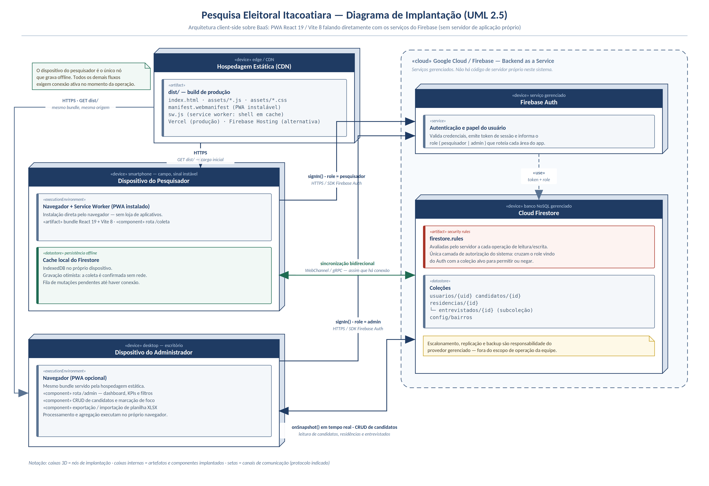

# Apresentação do Sistema — Pesquisa Eleitoral Itacoatiara

## Descrição breve

O **Pesquisa Eleitoral Itacoatiara** é uma aplicação web (PWA instalável) para coleta e análise de
intenção de voto em pesquisas eleitorais de rua, feita para o município de Itacoatiara-AM. Ele cobre
duas eleições em paralelo — deputado federal e deputado estadual — mantendo os dados de cada uma
completamente separados, do formulário de campo ao dashboard.

O sistema tem dois perfis de uso isolados por papel: **Pesquisador** (rota `/coleta`), que registra
entrevistas casa a casa em campo sem ver nenhum número agregado, e **Administrador** (rota `/admin`),
que acessa um dashboard analítico (KPIs, ranking de intenção de voto, evolução do candidato foco,
status por bairro), cadastro de candidatos e importação/exportação de dados em Excel.

## Arquitetura resumida

Aplicação **client-side** (React), sem servidor de aplicação próprio: o front-end fala direto com o
Firebase (Firestore como banco de dados, com persistência offline habilitada, e Firebase Auth para
login e papéis). As regras de quem pode ler/escrever cada coleção ficam em `firestore.rules`, avaliadas
pelo próprio Firestore a cada operação.



Modelo de dados: coleções `usuarios`, `candidatos`, `residencias` (com subcoleção `entrevistados`) e
`configuracoes/bairros`. Detalhes completos em `docs/descricao-sistema.md` e `docs/requisitos.md`.

## Principais funcionalidades

- Coleta casa a casa offline-first, com sincronização automática quando a conexão volta.
- Dashboard com KPIs, ranking de intenção de voto, evolução do candidato foco e status por bairro.
- Cadastro/edição/exclusão de candidatos (exclusão bloqueada se já houver voto registrado).
- Exportação e importação em lote de dados via planilha Excel.

## Como executar o sistema

Pré-requisitos: Node.js e um projeto Firebase (Firestore + Auth) configurado.

```bash
npm install
cp .env.example .env   # preencher com as chaves do projeto Firebase
npm run dev             # ambiente de desenvolvimento
npm run build            # build de produção
```

Instruções completas de configuração e deploy estão no `README.md` na raiz do repositório.
