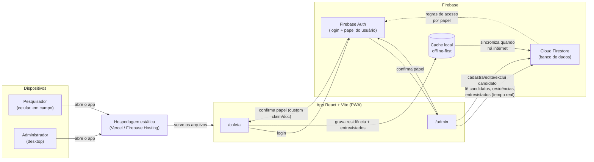
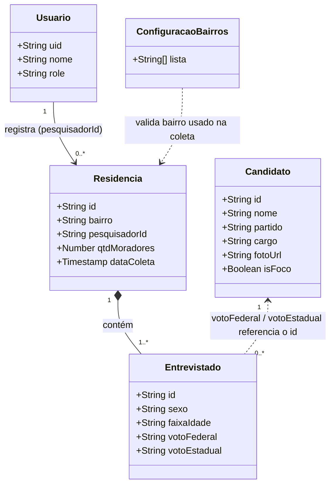

# Descrição do Sistema — Pesquisa Eleitoral Itacoatiara

## 1. Visão geral

O **Pesquisa Eleitoral Itacoatiara** é um sistema de coleta e análise de intenção de voto para pesquisas eleitorais de rua, feito sob medida para o município de **Itacoatiara-AM**. Ele cobre duas eleições em paralelo — **deputado federal** e **deputado estadual** — mantendo os dados de cada uma completamente separados, do formulário de campo ao dashboard.

O sistema nasceu de um problema concreto: uma equipe de campanha precisa que pesquisadores de rua registrem entrevistas casa a casa, muitas vezes em bairros com internet instável, e que essa informação vire números confiáveis para quem está coordenando a campanha — sem que o pesquisador em campo veja resultados parciais que possam influenciar sua neutralidade na coleta.

## 2. Perfis de uso

O sistema tem dois perfis de acesso, completamente isolados por papel (`role`) no Firebase Auth:

| Perfil | Rota | O que vê | O que não vê |
|---|---|---|---|
| **Pesquisador** | `/coleta` | Formulário de coleta casa a casa (bairro, moradores, voto) | Números agregados, gráficos, outros candidatos além dos cadastrados no formulário |
| **Administrador** | `/admin` | Dashboard analítico, cadastro de candidatos, importação/exportação de dados | — (acesso completo) |

Um usuário só enxerga a rota do seu próprio papel — tentar acessar a rota do outro papel redireciona automaticamente (`RotaProtegida`).

## 3. Arquitetura do sistema

O sistema é uma aplicação **client-side** (React) que fala diretamente com o **Firebase** — não existe um servidor de aplicação intermediário. A regra de negócio de quem pode ler/escrever o quê fica inteiramente nas **regras de segurança do Firestore**, não em uma API própria.

**Pontos-chave da arquitetura:**

- **Sem backend próprio.** Toda regra de acesso (quem pode ler/escrever o quê) está em `firestore.rules`, avaliada pelo próprio Firestore a cada operação.
- **Offline-first na coleta.** O Firestore mantém um cache local persistente no dispositivo do pesquisador; o formulário grava nesse cache instantaneamente e sincroniza sozinho quando a conexão volta — essencial para coleta em bairros com sinal ruim.
- **PWA instalável.** O app pode ser instalado na tela inicial do celular (Android/Chrome direto, iOS/Safari por instrução manual), rodando em tela cheia sem precisar de loja de aplicativos.
- **Hospedagem estática.** Como não há servidor de aplicação, o `dist/` gerado pelo build pode ser hospedado tanto no Firebase Hosting quanto na Vercel — hoje o sistema usa a Vercel.

## 4. Modelo de domínio (diagrama de classes)

O sistema não usa um banco relacional nem classes de domínio em orientação a objetos — os dados vivem como documentos no Firestore. Ainda assim, cada "coleção" tem um formato fixo e bem definido, que é o equivalente funcional de uma classe: os campos abaixo refletem exatamente a estrutura gravada e lida pelo código (camada `src/services/`).

**Notas sobre o modelo:**

- `role` em `Usuario` é uma string simples (`"pesquisador"` ou `"admin"`), não um enum do banco — a validação de valores é feita na aplicação e nas regras do Firestore.
- `cargo` em `Candidato` é `"federal"` ou `"estadual"` — os dois universos de dados nunca se misturam em nenhuma consulta ou agregação.
- `votoFederal` e `votoEstadual` em `Entrevistado` guardam o **id do documento do candidato**, ou os valores especiais `"indeciso"` / `"branco_nulo"` quando o entrevistado não declarou voto a um candidato.
- Só pode existir **um candidato `isFoco = true` por cargo** ao mesmo tempo — essa regra é aplicada no código (`garantirFocoUnico`), não é uma constraint nativa do Firestore.
- `Entrevistado` é uma **subcoleção** de `Residencia` (`residencias/{id}/entrevistados/{id}`), não uma coleção própria no nível raiz.

## 5. Principais funcionalidades

### Coleta (perfil Pesquisador)
- Registro de uma casa por vez: bairro → quantidade de moradores → dados de cada morador (sexo, faixa etária, voto federal, voto estadual).
- Gravação otimista no cache local — o pesquisador segue para a próxima casa sem esperar confirmação de rede.
- Aviso na tela se alguma casa falhar ao sincronizar de verdade (não apenas ficar pendente por falta de sinal).
- Banner de instalação do PWA na primeira visita.

### Dashboard (perfil Admin)
- **KPIs**: entrevistados, casas visitadas, bairros cobertos, última coleta.
- **Ranking de intenção de voto** por eleição (federal/estadual), com destaque visual pro candidato "foco" da campanha.
- **Evolução do candidato foco** ao longo do tempo (7/14/30 dias), federal vs. estadual.
- **Intenção do foco por bairro** (comparativo federal x estadual).
- **Status do foco por bairro** (lidera / empata / perde em relação aos concorrentes ali).
- Filtros por bairro, sexo, faixa etária e intervalo de datas.

### Candidatos (perfil Admin)
- Cadastro, edição e **exclusão** de candidatos.
- A exclusão é **bloqueada** se o candidato já tiver algum voto registrado — evita corromper relatórios e exportações históricas.
- Marcação de candidato "foco" (um por cargo).

### Dados (perfil Admin)
- Exportação de todos os dados brutos coletados em planilha Excel formatada.
- Importação em lote (retroativa, para digitar dados coletados em papel).
- Cadastro manual de uma casa pelo admin, reaproveitando o mesmo formulário da coleta — usado quando um pesquisador não consegue usar o app sozinho.

## 6. Tecnologias utilizadas

| Camada | Tecnologia |
|---|---|
| Front-end | React 19 + Vite 8 |
| Roteamento | React Router 7 |
| Gráficos | Recharts |
| Planilhas | ExcelJS + PapaParse |
| Estilização | CSS Modules + design tokens próprios (`src/styles/theme.css`) |
| Autenticação | Firebase Authentication |
| Banco de dados | Cloud Firestore (com persistência offline) |
| PWA | `vite-plugin-pwa` (service worker + manifest) |
| Hospedagem | Vercel (produção atual) / Firebase Hosting (alternativa configurada) |
| Versionamento | Git Flow (`main` / `develop` / `feature/*`), Conventional Commits em português |
