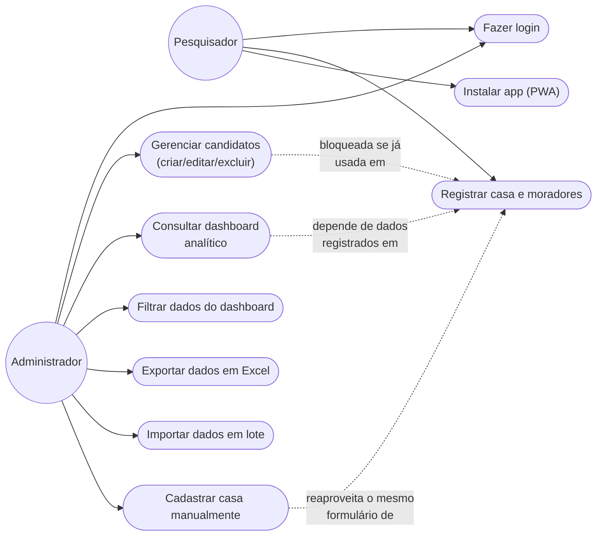

# Requisitos — Pesquisa Eleitoral Itacoatiara

## 1. Requisitos funcionais

### Autenticação e acesso

| ID | Requisito |
|---|---|
| RF01 | O sistema deve autenticar usuários por e-mail e senha (Firebase Auth). |
| RF02 | O sistema deve identificar o papel do usuário logado (`pesquisador` ou `admin`) e redirecioná-lo para a rota correspondente (`/coleta` ou `/admin`). |
| RF03 | O sistema deve impedir que um usuário acesse a rota de um papel que não é o seu, redirecionando-o para a rota correta. |
| RF04 | O sistema deve permitir logout a partir de qualquer tela autenticada. |

### Coleta de dados (perfil Pesquisador)

| ID | Requisito |
|---|---|
| RF05 | O sistema deve permitir registrar uma residência informando o bairro (de uma lista pré-cadastrada) e a quantidade de moradores. |
| RF06 | O sistema deve permitir registrar, para cada morador de uma residência, o sexo, a faixa etária e o voto declarado para deputado federal e para deputado estadual. |
| RF07 | O sistema deve permitir que o morador declare voto em "Indeciso" ou "Branco/Nulo", além de um candidato específico. |
| RF08 | O sistema deve gravar a coleta mesmo sem conexão de internet, sincronizando automaticamente quando a conexão for restabelecida. |
| RF09 | O sistema deve avisar o pesquisador caso alguma casa não consiga ser sincronizada por um erro real (não apenas por estar pendente de conexão). |
| RF10 | O sistema não deve exibir números agregados, gráficos ou resultados de intenção de voto na tela de coleta. |

### Gestão de candidatos (perfil Admin)

| ID | Requisito |
|---|---|
| RF11 | O sistema deve permitir cadastrar um candidato com nome, partido, cargo (federal/estadual) e, opcionalmente, uma foto. |
| RF12 | O sistema deve permitir editar os dados de um candidato existente. |
| RF13 | O sistema deve permitir marcar um candidato como "foco" da campanha, garantindo que exista no máximo um candidato foco por cargo simultaneamente. |
| RF14 | O sistema deve permitir excluir um candidato **somente se** ele ainda não tiver nenhum voto registrado. |
| RF15 | O sistema deve informar claramente ao administrador o motivo pelo qual uma exclusão foi recusada. |

### Dashboard analítico (perfil Admin)

| ID | Requisito |
|---|---|
| RF16 | O sistema deve exibir indicadores gerais: total de entrevistados, casas visitadas, bairros cobertos e data da última coleta. |
| RF17 | O sistema deve exibir o ranking de intenção de voto por eleição (federal e estadual), incluindo indecisos e brancos/nulos. |
| RF18 | O sistema deve destacar visualmente o candidato foco em relação aos demais, sem usar uma cor de identidade diferente da sua própria eleição. |
| RF19 | O sistema deve exibir a evolução da intenção de voto do candidato foco ao longo do tempo, com seleção de período (7, 14 ou 30 dias). |
| RF20 | O sistema deve exibir a intenção de voto do candidato foco por bairro, comparando federal e estadual. |
| RF21 | O sistema deve classificar, por bairro, se o candidato foco lidera, empata ou perde em relação ao concorrente mais votado ali. |
| RF22 | O sistema deve permitir filtrar os dados do dashboard por bairro, sexo, faixa etária e intervalo de datas. |

### Dados (perfil Admin)

| ID | Requisito |
|---|---|
| RF23 | O sistema deve permitir exportar todos os dados brutos coletados em uma planilha Excel formatada. |
| RF24 | O sistema deve permitir importar, em lote, dados de casas e moradores a partir de uma planilha (Excel ou CSV), validando cada linha antes de gravar. |
| RF25 | O sistema deve permitir que o administrador cadastre manualmente uma casa e seus moradores, para os casos em que o pesquisador não consiga usar o aplicativo em campo. |

### Instalação

| ID | Requisito |
|---|---|
| RF26 | O sistema deve se comportar como um aplicativo instalável (PWA) na tela inicial do celular, sem depender de loja de aplicativos. |

## 2. Requisitos não funcionais

| ID | Requisito |
|---|---|
| RNF01 | **Disponibilidade offline**: a coleta de dados deve funcionar sem conexão de internet, sincronizando automaticamente depois. |
| RNF02 | **Segurança por papel**: toda regra de leitura/escrita deve ser garantida no backend (regras do Firestore), não apenas escondida na interface. |
| RNF03 | **Responsividade**: a tela de coleta deve funcionar bem em celulares (uso principal em campo); o dashboard deve funcionar bem em telas de desktop. |
| RNF04 | **Desempenho de carregamento**: bibliotecas pesadas usadas só ocasionalmente (ex.: gerador de planilhas Excel) não devem entrar no pacote principal baixado por todo usuário. |
| RNF05 | **Consistência visual**: toda cor da interface deve seguir uma paleta de identidade fixa e documentada (`src/styles/theme.css`), sem cores decididas caso a caso. |
| RNF06 | **Integridade dos relatórios**: nenhuma ação do administrador deve poder corromper dados históricos já usados em relatórios (ex.: exclusão de candidato com voto registrado). |
| RNF07 | **Atualização silenciosa**: o aplicativo instalado deve se atualizar sozinho quando uma nova versão for publicada, sem exigir reinstalação. |

## 3. Regras de negócio

| ID | Regra |
|---|---|
| RN01 | Um usuário só pode ter um papel: `pesquisador` **ou** `admin` — nunca os dois. |
| RN02 | Cada candidato pertence a exatamente um cargo: `federal` **ou** `estadual`. |
| RN03 | Só pode existir um candidato marcado como foco por cargo ao mesmo tempo; marcar um novo foco desmarca automaticamente o anterior do mesmo cargo. |
| RN04 | Um candidato só pode ser excluído se não houver nenhum entrevistado com voto (federal ou estadual) registrado para ele. |
| RN05 | Uma residência só pode ser criada pelo próprio pesquisador que a coletou (`pesquisador_id` = uid do autor) ou pelo administrador (inserção em lote/manual). |
| RN06 | O bairro informado em uma coleta deve pertencer à lista de bairros pré-cadastrada pelo administrador. |
| RN07 | Um voto declarado deve ser um id de candidato do cargo correspondente, ou um dos valores especiais `indeciso` / `branco_nulo`. |
| RN08 | O status do candidato foco em um bairro (lidera/empata/perde) considera "empate" quando a diferença para o líder local é de até 5 pontos percentuais. |

## 4. Regras de acesso por papel (Firestore)

| Coleção | Pesquisador | Admin |
|---|---|---|
| `usuarios` | lê só o próprio documento | lê e escreve todos |
| `candidatos` | só leitura | leitura e escrita |
| `configuracoes` (bairros) | só leitura | leitura e escrita |
| `residencias` | cria e lê/edita só as próprias | cria, lê, edita e exclui todas |
| `residencias/{id}/entrevistados` | só cria | cria, lê, edita e exclui todas |

## 5. Casos de uso



## 6. Modelo de dados (diagrama entidade-relacionamento)

```mermaid
erDiagram
    USUARIO ||--o{ RESIDENCIA : "registra"
    RESIDENCIA ||--|{ ENTREVISTADO : "contém"
    CANDIDATO ||--o{ ENTREVISTADO : "recebe voto de (opcional)"
    CONFIGURACAO_BAIRROS ||--o{ RESIDENCIA : "restringe bairro de"

    USUARIO {
        string uid PK
        string nome
        string role
    }

    CANDIDATO {
        string id PK
        string nome
        string partido
        string cargo
        string fotoUrl
        boolean isFoco
    }

    RESIDENCIA {
        string id PK
        string bairro FK
        string pesquisadorId FK
        number qtdMoradores
        timestamp dataColeta
    }

    ENTREVISTADO {
        string id PK
        string residenciaId FK
        string sexo
        string faixaIdade
        string votoFederal FK
        string votoEstadual FK
    }

    CONFIGURACAO_BAIRROS {
        string documentoId PK
        string_array lista
    }
